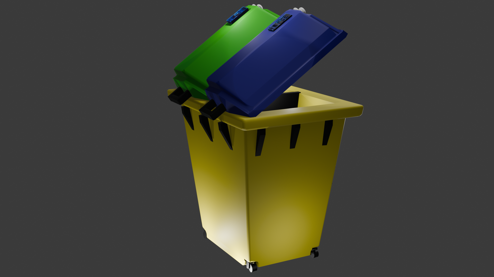
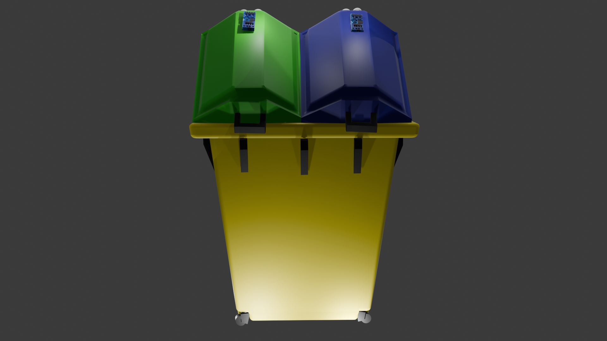
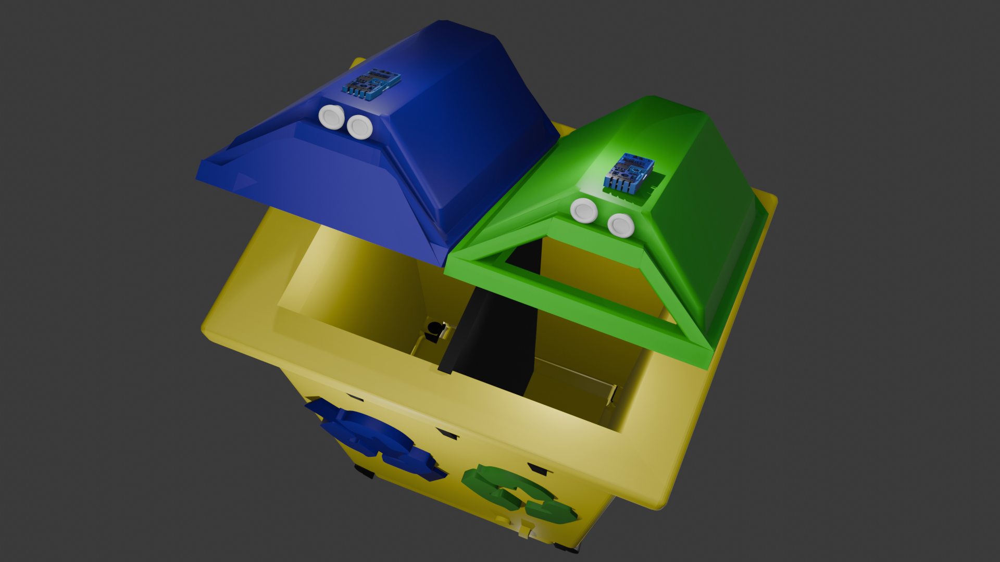
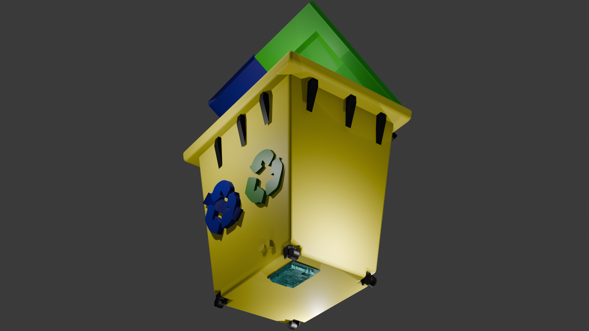

# Dustbin-in-Blender
This is 3d Blender project where I have designed a dustbin to detect biodegradable and non bio degradable waste and we hold it in front of the sensors and it will detect and accordingly the lid will open so you can throw the waste accurately.
## Introduction
Managing waste is a task that touches various aspects of our daily lives, spanning across different settings and environments. From homes to businesses, waste is a constant presence, and dealing with it responsibly is essential for the sustainable development of our communities. One common method of handling solid waste isnt strategically placing waste bins for collection. 
However, the personnel responsible for waste management often find themselves in a situation where they have to physically check the status of these bins without prior knowledge of whether they are full or empty. This presents two possible scenarios: either the bin still needs to be filled, requiring no immediate action, or it has reached its capacity and is overflowing, necessitating prompt attention to prevent environmental hazards and ensure proper disposal. 
In such instances, the effectiveness of waste management efforts hinges on the ability of personnel to promptly identify and address overflowing bins, thereby minimizing the risk of pollution and maintaining cleanliness in our surroundings. Hence, the importance of regular monitoring and efficient waste collection practices cannot be overstated in ensuring environmental sustainability and promoting a healthier living environment for all. 

## Implementation
### Methodology or Proposal 
Blender and inkspace are used for designing the smart dustbin.  
**_ _Setting up Blender:_ _** First, we open Blender and switch to the "Modeling"
workspace.  
**_ _Add a Cube:_ _** We start by adding a cube mesh object to our scene or by pressing Shift + A and selecting Mesh > Cube.  
**_ _Adjust Cube Properties:_ _** With the cube selected, we can adjust its properties in the bottom left corner of the screen. we can change the dimensions to match the size of a rectangular garbage bin.  
**_ _Edit Mode:_ _** Enter Edit mode by pressing Tab or selecting it from the mode dropdown menu in the top-left corner of the viewport. Here, you can manipulate the vertices, edges, and faces of the cube to shape it into a bin. We selected Face mode, scaled in the appropriate direction using the S key, and scaled the cube to a rectangular shape by adjusting its dimensions.  
**_ _Extrude:_ _** Extrude faces to create the inner part of the bin and add thickness. Use the Extrude tool (E) and scale (S) to adjust the thickness.  
**_ _Add Plane:_ _** We selected a plane with Shift + A and inserted it inside the bin to create a bifurcation as according to our project it is a garbage bin to hold both biodegradable and non-biodegradable after being detected by sensors. And then we extrude to give thickness sideways.  
**_ _Viewpoint shading:_ _** We can use use wireframe to adjust the plane and any internal edges that are not visible from the outside.  
**_ _Create Lid:_ _** we added another cube for the lid, scaled it down, and positioned it on top of the bin. Adjust its shape and thickness to fit the bin. To create more design we extruded and added more design to the top of the lid. Selecting the face we extruded to cover the front of the lid and deleted the front face to create an opening. Now we selected and duplicated the lid to cover the 2nd compartment. Scale the smaller. 
**_ _Add Wheels:_ _** Use Shift + A to add cylinders for the wheels. Scale and position them appropriately. You can duplicate them and adjust them as needed.  
**_ _Add Sensors:_ _** using a torus and cylinder we made the sensor structure that will sense the waste for the lid to open.   
**_ _Material and Shading:_ _** we can add more designs and handles to the lid. We have also tilted the lid to show the inner compartment. Join and Position: Join all parts of the bin together by selecting them and pressing Ctrl + J. Adjust the pivot point of the bin for animation by moving it to the desired location.  
**_ _Bevel:_ _** We selected the edges and face we want to smooth out edges using Ctrl + B for beveling.  
**_ _Final Touches:_ _** Fine-tune the details, such as adjusting the lid's opening animation and ensuring all parts fit together correctly. 
**_ _Color:_ _** We selected the dustbin object and added the base colour yellow. Next, we selected one of the lids and added the base colour blue for non-biodegradable and other one green denoting biodegradable. We gave the handle the colours accordingly. We have also added colurs to the wheels and selected the wheel object individually.  
**_ _Component:_ _** We have taken the pictures of aurdino, ir-board, and biodegradable signs and using inkspace we traced the bitmap path of the image and selected multicolour, under which chose colours, also checkbox remove background, smooth, and set the amount of scanning, then click apply. Then save a copy. Next, we will import them. They are imported as 3d and extruded to give thickness. Then changing colour and adding a plane with extruding we made a non-biodegradable sign.  
**_ _Lighting and Rendering:_ _** Set up your scene with appropriate lighting and camera angles. we can adjust the lighting by adding lights to the scene. Once satisfied, we can render our scene by going to the Render tab and clicking Render Image or Render Animation.  
## SOME OF THE 3D IMAGES OD THE BLENDER AFTER RENDERING  
 SIDE 1  
 SIDE 2  
 INSIDE   
 SIDE 3 AND BOTTOM    
## REST ARE IN THE FOLDER DUSTBIN 
